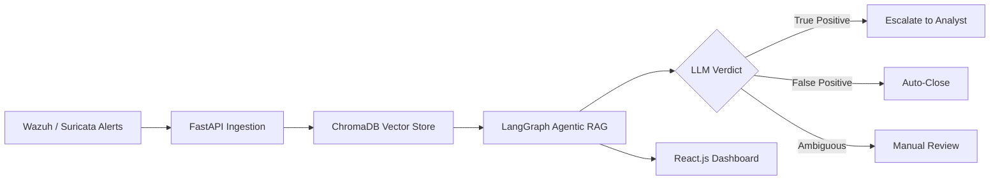

<!--
=====================================================================
MEHRAB SHAHEEN — GITHUB PROFILE README (RESTRUCTURED LAYOUT)
Same dark-navy / neon-cyan HUD theme, but the STRUCTURE is different:
- Quick-facts info card instead of a plain paragraph
- Skill proficiency bars (custom SVG) instead of badge lists
- Vertical timeline visual instead of an education table
- Collapsible 
 project cards instead of a static table

SETUP:
1. Repo named exactly like your GitHub username, public.
2. Upload to repo ROOT: header-scan.svg, divider.svg, footer-scan.svg,
   skill-bars.svg, timeline.svg
3. Paste this as README.md.
4. Replace every [ ] placeholder.
=====================================================================
-->

 

<!-- QUICK-FACTS CARD: business-card layout, two columns, no long paragraph -->
<table width="100%">
<tr>
<td width="60%" valign="top">

**Mehrab Shaheen**
Aspiring SOC Analyst · Blue Team Security

Comfortable investigating SIEM alerts, tracing malware samples through static/dynamic analysis, and building
AI-assisted tooling to make SOC triage faster and less noisy for analysts.

[Optional: 1 personal line on what drew you to blue team.]

</td>
<td width="40%" valign="top">

| | |
|---|---|
| 🎓 Degree | BS Information Technology |
| 🏫 Institution | University of Chakwal |
| 📅 Batch | 2022 – 2026 |
| 📊 CGPA | 3.48 / 4.0 |
| 📍 Location | Punjab, Pakistan |
| 🎯 Target Roles | SOC Analyst · Malware Analyst · DFIR |

</td>
</tr>
</table>

## `// 01` Journey So Far

## `// 02` Experience

<b>[Role / Title]</b> — [Company Name] · [Start Month Year] – [End Month Year]  <i>(click to expand)</i>

 

- [Responsibility 1 — e.g. Monitored SIEM alerts, performed initial triage]
- [Responsibility 2 — e.g. Investigated logs across endpoints using Wazuh/Suricata]
- [Responsibility 3 — e.g. Documented findings and escalated confirmed incidents]

*(If no internship yet, replace with a "Practical Experience" entry describing home-lab/FYP work — never fabricate a role.)*

## `// 03` Skill Proficiency

## `// 04` Certifications & Achievements

| Status | Title | Issuer | Year |
|---|---|---|---|
| ✅ | [Certification Name] | [Issuer] | [Year] |
| 🔄 | [Certification Name — In Progress] | [Issuer] | — |
| 🏆 | [Achievement] | [Details] | [Year] |

*(Only real, held items — delete rows that don't apply.)*

## `// 05` Projects

<b>🛡️ AI-Assisted SOC — Agentic RAG Alert Triage</b> <i>(Final Year Project)</i>

 

Final Year Project · University of Chakwal, Dept. of CS & IT
Supervisor: Ms. Zainab Nawab · Team: Mehrab Shaheen, Amna Nisar, Hira Ghous

An agentic RAG pipeline that ingests SOC alerts from Wazuh/Suricata, retrieves relevant context from ChromaDB, and
uses LangGraph-based LLM reasoning to classify and investigate alerts — reducing analyst workload from false
positives.

**Tech:** LangGraph · ChromaDB · FastAPI · React.js · Wazuh · Suricata · PostgreSQL
**Repository:** [LINK]

<b>🔎 SOC Alert Classifier</b>

 

LLM-based TRUE_POSITIVE / FALSE_POSITIVE / AMBIGUOUS verdict engine with six formal behavioral indicator categories
and priority-ordered decision logic.

**Tech:** Python · Prompt Engineering
**Repository:** [LINK]

<b>🦠 Malware Analysis Reports</b>

 

Static & dynamic analysis writeups — Agent Tesla, Remcos, LockBit, and Emotet-style samples — with IOCs and
behavioral indicators, written up to portfolio/CV standard.

**Tools:** PMAT-labs · Any.Run · Hybrid Analysis · theZoo
**Repository:** [LINK]

<b>💻 Portfolio Website</b>

 

Single-file, dark SOC-themed site with a live simulated alert feed.

**Tech:** HTML · CSS · JS
**Repository:** [LINK] · **Live Demo:** [LINK]

## `// 06` GitHub Activity

## `// 07` Contact

[YOUR_EMAIL] · [YOUR_LINKEDIN_URL] · [YOUR_GITHUB_URL] · [YOUR_TRYHACKME_URL] · Punjab, Pakistan

