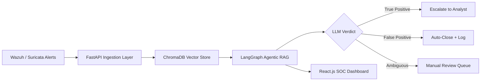

# Mehrab-Shaheen-Portfolio

<!--
=====================================================================
MEHRAB SHAHEEN — GITHUB PROFILE README
THEME: Dark-navy / neon-cyan HUD console — custom SVG header, footer,
and section dividers (no external gimmick tools for the visual identity).
Neat, professional, recruiter-focused. Minimal animation, used only
where it adds meaning (scanline, glow pulse, blinking cursor).

SETUP REQUIRED:
1. Create a repo named exactly like your GitHub username, make it public.
2. Inside it, create an /assets folder and upload:
   - header-scan.svg
   - divider.svg
   - footer-scan.svg
3. Paste this file as README.md in that repo root.
4. Replace every [ ] placeholder with your real information.
=====================================================================
-->

  

## `// 01` Profile Summary

Fresh **BS Information Technology** graduate (University of Chakwal, 2022–2026, CGPA 3.48/4.0) building a career
in **Blue Team security operations**. Practical, hands-on focus rather than theory alone — comfortable
investigating SIEM alerts, tracing malware samples through static/dynamic analysis, and now building AI-assisted
tooling to make SOC triage faster and less noisy for analysts.

[Optional: add 1–2 personal lines here — what pulled you toward blue team / SOC specifically.]

## `// 02` Education

| Degree | Institution | Duration | CGPA |
|---|---|---|---|
| BS Information Technology | University of Chakwal | 2022 – 2026 | 3.48 / 4.0 |

## `// 03` Experience

**[Role / Title]** — [Company Name]
[Start Month Year] – [End Month Year]

- [Responsibility 1 — e.g. Monitored SIEM alerts, performed initial triage]
- [Responsibility 2 — e.g. Investigated logs across endpoints using Wazuh/Suricata]
- [Responsibility 3 — e.g. Documented findings and escalated confirmed incidents]

*(If no internship yet, replace this block with "Practical Experience" describing home-lab / FYP work — do not leave it blank or fabricate a role.)*

## `// 04` Technical Skills

**SOC & Blue Team**

**Malware Analysis**

**AI for Security**

**Development**

## `// 05` Certifications & Achievements

| Status | Title | Issuer | Year |
|---|---|---|---|
| ✅ | [Certification Name] | [Issuer] | [Year] |
| 🔄 | [Certification Name — In Progress] | [Issuer] | — |
| 🏆 | [Achievement — e.g. Best FYP Nomination, Competition, Publication] | [Details] | [Year] |

*(List only real, held items — remove rows that don't apply yet.)*

## `// 06` Featured Project — AI-Assisted SOC (Agentic RAG)

**Final Year Project · University of Chakwal, Dept. of CS & IT**
Supervisor: Ms. Zainab Nawab · Team: Mehrab Shaheen, Amna Nisar, Hira Ghous

An agentic RAG pipeline that ingests SOC alerts from Wazuh/Suricata, retrieves relevant historical/threat context
from ChromaDB, and uses LangGraph-based LLM reasoning to classify and investigate alerts — reducing analyst
workload from false-positive noise.

**System Architecture**

**Tech Stack:** LangGraph · ChromaDB · FastAPI · React.js · Wazuh · Suricata · PostgreSQL
**Repository:** [LINK]

## `// 07` Other Projects

| Project | Description | Tech | Repository |
|---|---|---|---|
| SOC Alert Classifier | LLM-based TRUE_POSITIVE / FALSE_POSITIVE / AMBIGUOUS verdict engine with 6 behavioral indicator categories | Python | [LINK] |
| Malware Analysis Reports | Static & dynamic analysis writeups — Agent Tesla, Remcos, LockBit, Emotet-style samples with IOCs | PMAT-labs, Any.Run, theZoo | [LINK] |
| Portfolio Website | Dark, SOC-themed site with a live simulated alert feed | HTML / CSS / JS | [LINK] |

## `// 08` GitHub Activity

## `// 09` Contact

[YOUR_EMAIL] · [YOUR_LINKEDIN_URL] · [YOUR_GITHUB_URL] · [YOUR_TRYHACKME_URL] · Punjab, Pakistan

