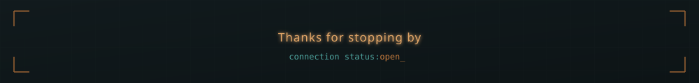

<!--
=====================================================================
MEHRAB SHAHEEN — GITHUB PROFILE README
Theme: "Signal & Noise" — matches personal portfolio website

SETUP:
1. Create a repo named exactly "MehrabShaheen" (your GitHub username), public.
2. Upload the /assets folder (header-scan.svg, divider.svg,
   experience-timeline.svg, footer-scan.svg) to the repo root.
3. Paste this file as README.md.
4. Replace YOUR_PORTFOLIO_URL with your live portfolio link once deployed.
=====================================================================
-->

Engineering intelligent Security Operations that transform raw telemetry into actionable threat intelligence.

## About

I build the bridge between traditional Security Operations and AI-assisted defense — the kind of analyst who reads raw logs by choice and still believes the best detections are explainable, not just accurate.

My foundation is deliberately hands-on. I've designed enterprise-style SOC and IT infrastructure labs from the ground up — Active Directory, SIEM pipelines, IDS/IPS, threat intelligence feeds — and used them to run real investigations: alert triage, malware analysis, phishing forensics, privilege escalation. That practical base is backed by formal training on both sides of the discipline: **EC-Council's Certified Ethical Hacker (CEH)**, **Google's Cybersecurity Professional Certificate**, and **NAVTTC's Cyber Security Training Program**, covering network security, penetration testing, and SOC fundamentals — validated further by ranking in the **top 4.6% nationwide** in Pakistan's HEC/PSEB/P@SHA National Skill Competency Test.

Where I focus now is the intersection: using **Retrieval-Augmented Generation**, contextual reasoning, and behavioral correlation to help analysts move faster through alert noise — without ever taking the human out of the decision. My flagship project, an AI-Assisted SOC platform, is built entirely around that principle.

## Core Expertise

 

## ⭐ AI-Assisted SOC — Flagship Project

> **Final Year Project**
> An enterprise-inspired AI-assisted Security Operations Center platform designed to reduce alert fatigue and accelerate security investigations by transforming high-volume security telemetry into contextual, analyst-ready intelligence.

| Capability | Description |
|---|---|
| 🧠 AI Investigation | Generates contextual investigation insights |
| 🔍 Alert Triage | Prioritizes high-risk security events |
| 🔗 Behavioral Correlation | Connects related attack activities |
| 📚 Context Retrieval | Uses RAG for investigation context |
| 🎯 Threat Intelligence | Enriches alerts with external intelligence |
| 📊 SOC Dashboard | Centralized monitoring and investigation |
| ⚡ AI Assistant | Supports analyst decision-making |
| 🛡️ Explainable Analysis | Provides reasoning behind AI outputs |

**Tech Stack**

## Featured Repositories

| Repository | Description |
|---|---|
| 🤖 [AI-Assisted SOC](https://github.com/MehrabShaheen/AI-powered-SOC-Assistant-for-Automated-Alert-Analysis-and-Incident-Investigation) | Enterprise AI-powered SOC platform for intelligent alert investigation |
| 🛡️ [Enterprise SOC Home Lab](https://github.com/MehrabShaheen/Enterprise-SOC-Home-Lab) | Enterprise-style Security Operations Center with attack simulation |
| 🏢 [Enterprise IT Infrastructure Lab](https://github.com/MehrabShaheen/Enterprise-IT-Infrastructure-Lab) | Virtualized enterprise infrastructure — Active Directory, DNS, DHCP, pfSense |
| 📡 [Splunk SIEM Lab](https://github.com/MehrabShaheen/Splunk-SIEM-Lab) | Centralized log collection, SPL queries, dashboards, and alerting |
| 🔍 [SOC Alert Investigations](https://github.com/MehrabShaheen/SOC-Alerts-Investigations) | Structured investigations — alert triage, log correlation, IOC analysis |
| 🦠 [Malware Analysis](https://github.com/MehrabShaheen/Malware-Analysis) | Static & dynamic malware analysis reports and reverse engineering |
| 🎯 [Cyber Threat Intelligence](https://github.com/MehrabShaheen/Cyber-Threat-Intelligence) | IOC enrichment, MITRE ATT&CK mapping, MISP, and OpenCTI workflows |
| ✉️ [Phishing Email Analysis](https://github.com/MehrabShaheen/Phishing-Email-Analysis) | Header analysis, spoofing techniques, and email-based IOCs |
| 🪟 [Windows Privilege Escalation Lab](https://github.com/MehrabShaheen/Windows-Privilege-Escalation-Lab) | Windows privilege escalation techniques in controlled lab environments |

## Technical Stack

 

## Experience

 

<table>
<tr>
<td width="50%" valign="top">

**SOC Analyst Intern** · CyberFix
`Jul 2025 – Oct 2025` — Remote / Islamabad, Pakistan

Worked inside an enterprise-style Security Operations environment, taking ownership of monitoring and investigation rather than just observing it.

- Deployed a Home SOC Lab — Windows Server, Active Directory, pfSense, Suricata
- Ran centralized monitoring with Wazuh SIEM, Sysmon, and log pipelines
- Built Splunk dashboards, SPL queries, and alerting rules
- Investigated phishing emails and enriched findings via MISP / OpenCTI
- Documented incidents in structured, SOC-style reports

`Wazuh` `Splunk` `Sysmon` `pfSense` `Suricata` `MISP` `OpenCTI` 'Spunk' Active Dircetory'

</td>
<td width="50%" valign="top">

**Cybersecurity Intern** · Bits Phile
`Apr 2025 – Jul 2025` — Chakwal, Pakistan

Built the fundamentals that everything after this internship stood on — reconnaissance, traffic analysis, and defensive labs.

- Performed recon and vulnerability assessments (Nmap, OpenVAS)
- Conducted OSINT and EXIF metadata investigations
- Analyzed traffic with Wireshark to flag suspicious patterns
- Completed privilege escalation and endpoint defense labs
- Simulated phishing/social engineering to sharpen detection skills

`Nmap` `OpenVAS` `Wireshark` `Splunk` `Wazuh` `MITRE ATT&CK`

</td>
</tr>
</table>

## Certifications

| Certification | Status |
|---|---|
| Top 4.6% Nationwide — HEC / PSEB / P@SHA National Skill Competency Test | ✅ |
| EC-Council Certified Ethical Hacker (CEH) | ✅ |
| Google Cybersecurity Professional Certificate | ✅ |
| Cyber Security Training Program — NAVTTC | ✅ |

## Let's Connect

