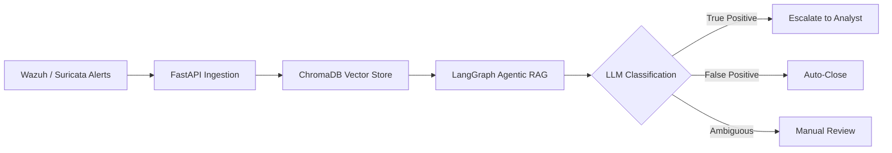

# Mehrab-Shaheen-Portfolio

<!--
=====================================================================
MEHRAB SHAHEEN — GITHUB PROFILE README
STYLE: Clean, professional, blue theme. Minimal animation (top banner +
typing effect only). No gimmicks, no childish emojis, recruiter-focused.
Fill in every [ ] placeholder with your real information.
=====================================================================
-->

 

 

## Professional Summary

Fresh BS Information Technology graduate (University of Chakwal, 2022–2026, CGPA 3.48/4.0) building a career in
Blue Team security operations. Practical experience in SIEM alert investigation, log analysis, and malware sample
analysis, along with a Final Year Project focused on an agentic RAG-based system for AI-assisted SOC alert triage.

---

## Education

| Degree | Institution | Duration | CGPA |
|---|---|---|---|
| BS Information Technology | University of Chakwal | 2022 – 2026 | 3.48 / 4.0 |

---

## Experience

**[Role / Title]** — [Company Name]
[Start Month Year] – [End Month Year]

- [Responsibility 1]
- [Responsibility 2]
- [Responsibility 3]

*(Replace with real internship details, or remove this section and keep only "Practical Experience" below if none yet.)*

---

## Technical Skills

**SOC & Blue Team:** Alert Triage & Investigation · Log Analysis · SIEM Monitoring (Wazuh, Suricata) · Incident Documentation

**Malware Analysis:** Static & Dynamic Analysis · String/IOC Extraction · Sandbox Analysis (Any.Run, Hybrid Analysis)

**AI for Security:** Agentic RAG (LangGraph, ChromaDB) · LLM-Based Alert Classification · RAGAS Evaluation

**Development:** Python · FastAPI · React.js · PostgreSQL

---

## Featured Project — AI-Assisted SOC (Agentic RAG)

**Final Year Project · University of Chakwal, Dept. of CS & IT**
Supervisor: Ms. Zainab Nawab · Team: Mehrab Shaheen, Amna Nisar, Hira Ghous

An agentic RAG pipeline that ingests SOC alerts from Wazuh/Suricata, retrieves relevant context from ChromaDB, and
uses LangGraph-based LLM reasoning to classify and investigate alerts — reducing analyst workload from false
positives.

**Tech:** LangGraph · ChromaDB · FastAPI · React.js · Wazuh · Suricata · PostgreSQL
**Repository:** [LINK]

---

## Other Projects

| Project | Description | Tech | Link |
|---|---|---|---|
| SOC Alert Classifier | LLM-based TRUE_POSITIVE / FALSE_POSITIVE / AMBIGUOUS verdict engine | Python | [LINK] |
| Malware Analysis Reports | Static & dynamic writeups — Agent Tesla, Remcos, LockBit, Emotet-style | PMAT-labs, Any.Run | [LINK] |
| Portfolio Website | Dark, SOC-themed site with a live simulated alert feed | HTML/CSS/JS | [LINK] |

---

## Certifications

| Certification | Issuer | Year |
|---|---|---|
| [Certification Name] | [Issuer] | [Year] |

*(Remove or mark as "In Progress" if not yet completed.)*

---

## GitHub Stats

---

## Contact

[YOUR_EMAIL] · [YOUR_LINKEDIN_URL] · [YOUR_GITHUB_URL] · Punjab, Pakistan

