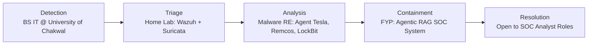

# Mehrab-Shaheen-Portfolio
<!--
=====================================================================
MEHRAB SHAHEEN — GITHUB PROFILE README
CONCEPT: "SOC Analyst Console" — profile framed as a terminal/SIEM
console boot sequence, alert cards instead of generic project boxes,
and an incident-response-style skills/journey diagram.
Fill in every [ ] placeholder with your real information.
=====================================================================
-->

<pre>
<code>
┌──────────────────────────────────────────────────────────────────┐
│  soc-console:~$ whoami                                           │
│  mehrab.shaheen — blue team analyst (aspiring) / IT graduate     │
│                                                                    │
│  soc-console:~$ cat status.log                                   │
│  [OK] BS Information Technology — University of Chakwal (2022-2026)
│  [OK] CGPA: 3.48 / 4.0                                            │
│  [OK] Location: Punjab, Pakistan                                  │
│  [ACTIVE] Focus: SOC Ops · Malware Analysis · Detection Eng · DFIR│
└──────────────────────────────────────────────────────────────────┘
</code>
</pre>

 

<!-- Contact strip styled as system tags, not generic badges -->

<code>root@mehrab</code> → 
<a href="mailto:[YOUR_EMAIL]"><code>email</code></a> ·
<a href="[YOUR_LINKEDIN_URL]"><code>linkedin</code></a> ·
<a href="[YOUR_GITHUB_URL]"><code>github</code></a> ·
<a href="[YOUR_TRYHACKME_URL]"><code>tryhackme</code></a> ·
<code>views: </code>

 

---

## `[case_id: 0x01]` About This Analyst

Fresh IT graduate transitioning into **Blue Team security operations**. Rather than a checklist of buzzwords,
here's the real working style: comfortable reading raw logs and PCAPs, patient enough to trace a sample through
static and dynamic analysis, and now building AI-assisted tooling to make SOC triage faster and less noisy.

> [Optional 1-2 lines — what drives you into blue team specifically, add a personal note here.]

---

## `[case_id: 0x02]` Skill Inventory — Severity Tagged

*(Severity here = confidence/comfort level, borrowed from alert-triage language — not a real threat rating)*

<table>
<tr><td><code>CRITICAL</code></td><td>Alert Triage & Investigation · Log Analysis (Wazuh/Suricata) · Malware Static/Dynamic Analysis</td></tr>
<tr><td><code>HIGH</code></td><td>Python · FastAPI · LangGraph / Agentic RAG · ChromaDB · Prompt Engineering</td></tr>
<tr><td><code>MEDIUM</code></td><td>React.js · PostgreSQL · RAGAS Evaluation · Report Writing / Documentation</td></tr>
<tr><td><code>MONITORING</code></td><td>[Add tools you're currently learning — e.g. Splunk, YARA, Volatility]</td></tr>
</table>

---

## `[case_id: 0x03]` Incident Response Log — Featured Work

<table>
<tr>
<td width="100%">

**INC-001 · AI-Assisted SOC — Agentic RAG Alert Triage** `[FYP]`
Final Year Project, University of Chakwal · Supervisor: Ms. Zainab Nawab · Team: Amna Nisar, Hira Ghous
Agentic RAG pipeline that ingests Wazuh/Suricata alerts, retrieves context via ChromaDB, and reasons through
LangGraph to cut down false-positive noise for analysts.
`LangGraph` `ChromaDB` `FastAPI` `React.js` `PostgreSQL` — **Repo:** [LINK]

</td>
</tr>
<tr>
<td width="100%">

**INC-002 · LLM-Based SOC Alert Classifier**
Production-style classification engine — TRUE_POSITIVE / FALSE_POSITIVE / AMBIGUOUS verdicts using 6 behavioral
indicator categories with priority-ordered decision logic.
`Python` `Prompt Engineering` — **Repo:** [LINK]

</td>
</tr>
<tr>
<td width="100%">

**INC-003 · Malware Analysis Reports**
Static & dynamic analysis writeups — Agent Tesla, Remcos, LockBit, Emotet-style samples — with IOCs and behavioral
indicators, written up for portfolio-grade review.
`PMAT-labs` `Any.Run` `Hybrid Analysis` `theZoo` — **Repo:** [LINK]

</td>
</tr>
<tr>
<td width="100%">

**INC-004 · [Portfolio Site — Dark Terminal / SOC Aesthetic]**
Single-file animated site with a live simulated alert feed.
`HTML` `CSS` `JS` — **Repo:** [LINK] · **Demo:** [LINK]

</td>
</tr>
</table>

<!-- Add more INC-00X rows as new projects ship -->

---

## `[case_id: 0x04]` Escalation Path — How I Got Here

---

## `[case_id: 0x05]` Certifications

<!-- Only real, held certifications. Delete row if none, or mark as "In Progress". -->

| Status | Certification | Issuer | Year |
|---|---|---|---|
| ✅ | [Cert Name] | [Issuer] | [Year] |
| 🔄 | [Cert Name — In Progress] | [Issuer] | — |

---

## `[case_id: 0x06]` Telemetry

---

<pre align="center">
<code>soc-console:~$ echo "case closed — analyst online"
[END OF LOG]</code>
</pre>

