<!--
=====================================================================
MEHRAB SHAHEEN — GITHUB PROFILE README
Theme: "Signal & Noise" — matches personal portfolio website

SETUP:
1. Create a repo named exactly "MehrabShaheen" (your GitHub username), public.
2. Upload the /assets folder (header-scan.svg, divider.svg,
   experience-timeline.svg, footer-scan.svg) to the repo root.
3. Paste this file as README.md.
4. Replace YOUR_PORTFOLIO_URL with your live portfolio link once deployed.
=====================================================================
-->

Engineering intelligent Security Operations that transform raw telemetry into actionable threat intelligence.

## About

I specialize in Security Operations, threat detection, and AI-assisted security engineering — building enterprise-style SOC and IT infrastructure labs, and running real investigations across SIEM, malware analysis, and threat intelligence.

My flagship project, an AI-Assisted SOC platform, applies Retrieval-Augmented Generation and contextual reasoning to cut through alert noise and speed up investigations, while keeping the analyst firmly in control of every decision.

Next, I'm focused on deepening detection engineering and threat hunting as I move into a full-time SOC Analyst role.

## Core Expertise

 

## ⭐ AI-Assisted SOC — Flagship Project

> **Final Year Project**
> An enterprise-inspired AI-assisted Security Operations Center platform designed to reduce alert fatigue and accelerate security investigations by transforming high-volume security telemetry into contextual, analyst-ready intelligence.

| Capability | Description |
|---|---|
| 🧠 AI Investigation | Generates contextual investigation insights |
| 🔍 Alert Triage | Prioritizes high-risk security events |
| 🔗 Behavioral Correlation | Connects related attack activities |
| 📚 Context Retrieval | Uses RAG for investigation context |
| 🎯 Threat Intelligence | Enriches alerts with external intelligence |
| 📊 SOC Dashboard | Centralized monitoring and investigation |
| ⚡ AI Assistant | Supports analyst decision-making |
| 🛡️ Explainable Analysis | Provides reasoning behind AI outputs |

**Tech Stack**

## Featured Repositories

| Repository | Description |
|---|---|
| 🤖 [AI-Assisted SOC](https://github.com/MehrabShaheen/AI-powered-SOC-Assistant-for-Automated-Alert-Analysis-and-Incident-Investigation) | Enterprise AI-powered SOC platform for intelligent alert investigation |
| 🛡️ [Enterprise SOC Home Lab](https://github.com/MehrabShaheen/Enterprise-SOC-Home-Lab) | Enterprise-style Security Operations Center with attack simulation |
| 🏢 [Enterprise IT Infrastructure Lab](https://github.com/MehrabShaheen/Enterprise-IT-Infrastructure-Lab) | Virtualized enterprise infrastructure — Active Directory, DNS, DHCP, pfSense |
| 📡 [Splunk SIEM Lab](https://github.com/MehrabShaheen/Splunk-SIEM-Lab) | Centralized log collection, SPL queries, dashboards, and alerting |
| 🔍 [SOC Alert Investigations](https://github.com/MehrabShaheen/SOC-Alerts-Investigations) | Structured investigations — alert triage, log correlation, IOC analysis |
| 🦠 [Malware Analysis](https://github.com/MehrabShaheen/Malware-Analysis) | Static & dynamic malware analysis reports and reverse engineering |
| 🎯 [Cyber Threat Intelligence](https://github.com/MehrabShaheen/Cyber-Threat-Intelligence) | IOC enrichment, MITRE ATT&CK mapping, MISP, and OpenCTI workflows |
| ✉️ [Phishing Email Analysis](https://github.com/MehrabShaheen/Phishing-Email-Analysis) | Header analysis, spoofing techniques, and email-based IOCs |
| 🪟 [Windows Privilege Escalation Lab](https://github.com/MehrabShaheen/Windows-Privilege-Escalation-Lab) | Windows privilege escalation techniques in controlled lab environments |

## Experience

 

<table>
<tr>
<td width="50%" valign="top">

**SOC Analyst Intern** · CyberFix
`Jul 2025 – Oct 2025` — Remote / Islamabad, Pakistan

Worked in an enterprise-style Security Operations environment focused on security monitoring, SIEM operations, threat detection, incident investigation, attack simulation, and AI-assisted security workflows through practical blue team activities.

<b>View Responsibilities</b>

- Designed and deployed an enterprise-style Home SOC Lab with Windows Server, Active Directory, DNS, DHCP, pfSense, Suricata, and multiple Windows endpoints.
- Configured centralized security monitoring using Wazuh SIEM, Sysmon, and log collection pipelines for alert triage and endpoint visibility.
- Built Splunk dashboards, developed SPL queries, configured alerting, and analyzed security events across the enterprise lab.
- Investigated phishing emails by analyzing headers, spoofing techniques, suspicious URLs, and email-based indicators of compromise.
- Integrated threat intelligence using MISP and OpenCTI to enrich investigations and improve contextual analysis.
- Executed attack simulations to validate detection capabilities and strengthen blue team investigation workflows.
- Produced SOC-style incident reports documenting alerts, evidence, affected systems, root cause analysis, and response observations.
- Documented enterprise deployments, detection workflows, dashboards, and investigation procedures to support repeatable SOC operations.

`Wazuh` `Splunk` `Sysmon` `pfSense` `Suricata` `MISP` `OpenCTI` `Windows Server` `Active Directory`

</td>
<td width="50%" valign="top">

**Cybersecurity Intern** · Bits Phile
`Apr 2025 – Jul 2025`  Chakwal, Pakistan

Built foundational blue team skills through practical cybersecurity labs covering vulnerability assessment, reconnaissance, network security, SIEM monitoring, and incident investigation.

<b>View Responsibilities</b>

- Performed network reconnaissance, service enumeration, and vulnerability assessments using Nmap and OpenVAS.
- Conducted OSINT investigations and EXIF metadata analysis to support intelligence gathering activities.
- Analyzed network traffic using Wireshark to identify suspicious communication patterns and potential indicators of compromise.
- Completed practical defensive security labs focused on privilege escalation, Windows security, endpoint analysis, and attack simulation.
- Deployed and configured SIEM, IDS/IPS, endpoint monitoring, and centralized logging solutions within controlled environments.
- Developed basic Splunk dashboards, SIEM detection use cases, and monitoring workflows.
- Simulated phishing and social engineering attacks to strengthen detection and investigation skills.
- Applied MITRE ATT&CK techniques and IOC analysis during security investigations.
- Produced structured incident reports and technical documentation following SOC reporting practices.

`Nmap` `OpenVAS` `Wireshark` `Splunk` `Wazuh` `Sysmon` `pfSense` `Suricata` `MITRE ATT&CK`

</td>
</tr>
</table>

## Certifications

| Certification | Status |
|---|---|
| Top 4.6% Nationwide — HEC / PSEB / P@SHA National Skill Competency Test | ✅ |
| EC-Council Certified Ethical Hacker (CEH) | ✅ |
| Google Cybersecurity Professional Certificate | ✅ |
| Cyber Security Training Program — NAVTTC | ✅ |

## Let's Connect

