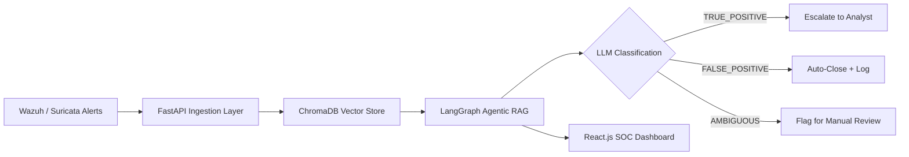

# Mehrab-Shaheen-Portfolio
<!--
=====================================================================
MEHRAB SHAHEEN — ANIMATED GITHUB PROFILE README (TEMPLATE)
Fill in every [ ] placeholder with your real information.
GitHub renders: capsule-render banners, typing SVG, skillicons.dev,
Mermaid diagrams, and shields.io badges — all officially supported.
=====================================================================
-->

<div align="center">


<br/>

<!-- Stacked badge-style link rows (label + value blocks) -->
<table>
<tr><td align="right"></td><td><a href="[YOUR_LINKEDIN_URL]"></a></td></tr>
<tr><td align="right"></td><td><a href="[YOUR_TRYHACKME_URL]"></a></td></tr>
<tr><td align="right"></td><td><a href="[YOUR_GITHUB_URL]"></a></td></tr>
<tr><td align="right"></td><td></td></tr>
</table>

<hr/>

<!-- Big rounded gradient name banner (pill style) -->


<br/>

<a href="https://git.io/typing-svg">
  
</a>

</div>

<br/>

## 🧑 A Bit More About Me

```yaml
name: Mehrab Shaheen
role: Aspiring SOC Analyst | Blue Team Enthusiast
degree: BS Information Technology, University of Chakwal (2022 - 2026)
cgpa: 3.48 / 4.0
focus: SOC Operations · Malware Analysis · Detection Engineering · DFIR
current_project: "AI-Assisted SOC — Agentic RAG for Alert Triage"
location: Punjab, Pakistan
fun_fact: "[optional — add something personal/fun here]"
```

---

## 🧠 What I Do

<table>
<tr>
<td width="50%" valign="top">

### 🔎 SOC & Blue Team
- Alert triage & investigation
- SIEM log analysis (Wazuh, Suricata)
- Incident documentation & escalation
- False positive / true positive verdicting

</td>
<td width="50%" valign="top">

### 🦠 Malware Analysis
- Static & dynamic analysis
- String/IOC extraction
- Sandbox analysis (Any.Run, Hybrid Analysis)
- Report writing (Agent Tesla, Remcos, LockBit, Emotet-style)

</td>
</tr>
<tr>
<td width="50%" valign="top">

### 🤖 AI for Security
- Agentic RAG pipelines (LangGraph + ChromaDB)
- LLM-based alert classification
- RAGAS evaluation of RAG systems
- Prompt engineering for SOC use cases

</td>
<td width="50%" valign="top">

### 📄 Documentation
- Professional analysis reports
- Architecture diagrams
- Clean, structured technical writing
- [Add more]

</td>
</tr>
</table>

---

## 🛠️ Tech Stack

<div align="center">


<br/><br/>


</div>

---

## 🏗️ Featured Project — AI-Assisted SOC (Agentic RAG)

**Final Year Project · University of Chakwal · Dept. of CS & IT**
Supervisor: Ms. Zainab Nawab · Team: Mehrab Shaheen, Amna Nisar, Hira Ghous

An agentic RAG-based system that ingests SOC alerts and uses retrieval + LLM reasoning to reduce analyst fatigue
from false positives.



**Tech:** LangGraph · ChromaDB · FastAPI · React.js · Wazuh · Suricata · PostgreSQL
**Repo:** [LINK]

---

## 🧪 More Projects

<table>
<tr>
<td width="33%" valign="top">

### 🔹 SOC Alert Classifier
LLM-based TRUE_POSITIVE / FALSE_POSITIVE / AMBIGUOUS verdict engine with 6 behavioral indicator categories.

**Repo:** [LINK]

</td>
<td width="33%" valign="top">

### 🔹 Malware Analysis Reports
Static/dynamic writeups — Agent Tesla, Remcos, LockBit, Emotet-style samples with IOCs & MITRE mapping.

**Repo:** [LINK]

</td>
<td width="33%" valign="top">

### 🔹 Portfolio Website
Dark terminal/SOC-themed single-file site with a live simulated alert feed.

**Repo:** [LINK] · **Demo:** [LINK]

</td>
</tr>
</table>

---

## 📜 Certifications

<!-- Only list what you actually hold. Delete row if none yet. -->

| Certification | Issuer | Year |
|---|---|---|
| [Cert Name] | [Issuer] | [Year] |
| *Currently pursuing:* [Cert Name] | [Issuer] | — |

---

## 📊 GitHub Analytics

<div align="center">


</div>

<div align="center">

</div>

---

## 📫 Let's Connect

<div align="center">

[YOUR_EMAIL] · [YOUR_LINKEDIN_URL] · [YOUR_GITHUB_URL] · Punjab, Pakistan


</div>
